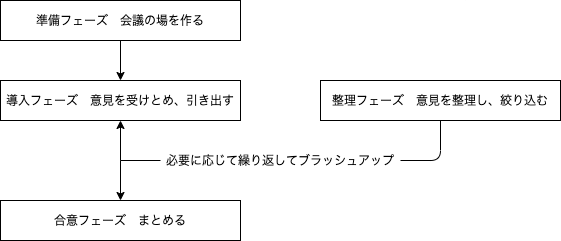

# いま求められるディレクションの理想型

多岐に渡るジャンルのスタッフを総括するディレクターのマネージメント力

## Webディレクションの役割

- 成果物を作り上げる
- クライアントのビジネスを理解する
- ビジネスを成功に導く

ディレクション担当者がやるべきこと

- プロジェクトメンバーで目標を共有して、プロジェクトをすすめるための場を作ること
- プロジェクトをゴールに導くための継続的な場の構築
  - Webに関する専門知識
  - クライアントの最終的な満足のためにあえてNOという対応ができること
  - プロジェクトメンバー間でのコミュニケーション推進

### ディレクターが担う6つのマネジメント

|名称|例|
|--|--|
|スコープ|成果物、作業範囲、優先事項を決める   プロジェクトの目標達成のために必要な成果物/タスクを定義し、必要に応じてその定義を見直す|
|コスト|予算、工数、時間を明確にし、コストの整合性を確保する   予算内に完了させるためにWBSを定義し、スケジュールを作成しながらコストを見積もる   進捗確認とコスト超過しないためのコントロール|
|ヒューマンリソース|プロジェクトメンバーの役割を定義する   人員確保、適材適所なスタッフィングを実現   進行中にリソース不足を回避するように調整|
|コミュニケーション|プロジェクト内でどのようにコンセンサス（意思決定フローの明確化）を取るか   工程ごとに   - 承認者は誰か   - クライアント社内での承認プロセスはどのようになっているのか   を確認しておく|
|リスク|リスクの事前想定と対策/検討/手配する   リスクとは   - 各工程における進行の遅れ   - 制作工程における設計ミス/漏れ   管理表作成とチェックをして、リスク発生時は対応策（計画）通りに対応|
|クオリティ|成果物の完成度を設定し、達成する   成果物が要求/クライアントの隠れた要求/使用に適している品質を満たす|

## 求められるファシリテーション力

ファシリテーション  
> 会議等の場で、発言や参加を促したり、話の流れを整理したり、参加者の認識の一致を確認したりする行為で介入し、合意形成や相互理解をサポートすることにより、組織や参加者の活性化、協働を促進させるリーダーの持つ能力のひとつ。

複数人が集まって行う行動がスムーズかつ効率よく進められるようにサポートすること

プロセスの進め方に着目し、問題が生じないように予防する  
問題が起こったとしてもすぐに処理できる点に重きを置く

### ファシリテーションのポイント

