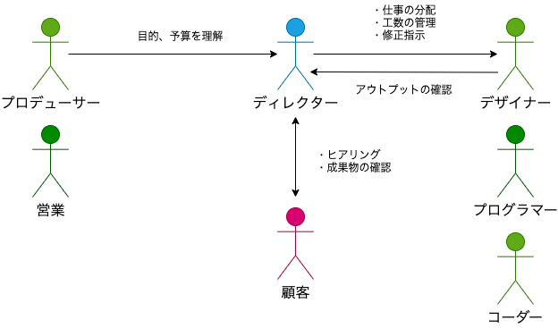

# ディレクションの成り立ちと時代による変化

## ディレクションという役割の成り立ち

### 旧来のWebディレクターの弱点

- プロジェクトの**スタートからローンチまで**一貫して**ミクロ/マクロ**両方の視点で**全体を見渡す**人が必要
- 専門職同士の高度な技術的調査が必要
- トレンド、新技術から導入すべきものを取捨選択する必要がある
- 顧客の満足を捨てても結果を出す成果物を作り上げる作り上げる必要がある
- 運用フロー、マーケティング、コンテンツメイキング、アクセス解析などの知識が要る

## 新しい時代のWebディレクター像

- 基本的には、制作予算/工数の兼ね合いをとりつつ、専門職を活用して納期までに顧客の納得できる成果物を納品する
- ユーザー視点で成果物をチェックし、違和感のある箇所は必ず質問や修正依頼を出す
  - 自分が**的はずれな質問をしていたとしても、それが今後の知見になる**
- トレンドを押さえ、積極的に企画提案していく
  - 日頃から多くのWebサイトを見ておく
    - UXを体験する
  - 技術的に実現している方法を調べる

## ディレクターがやってはいけないこと

- 自分で手を動かす
  - 専門職に任せる
  - 緊急事態に備え、外部スタッフのコネクションを多くストックしておく
