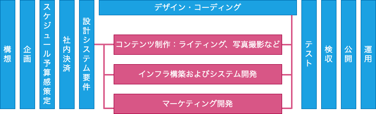

# プロジェクトの工程管理とリスクヘッジのあり方

## プロジェクトの始まりと終わり

- 担当外のフェーズに関しても意見を求められるように慣れば一人前

## 手戻りの可能性を考慮する

WBS通りに作業が行くとは限らない  
常に作業と次の作業の作業の間に確認を入れる

## ユーザーの視点を入れる

基本的に制作側はユーザーの立場に立つことはできない  
ツールを活用しながら、工程にユーザーの視点を入れる

- 市場調査
- サービスの全体像をとらえるインタビュー（サービスサファリ、シャドーイング）
- フロー図の作成（カスタマージャーニーマップ）
- モックアップを利用したユーザーへのテスト
- β版リリースによるテストマーケティング
