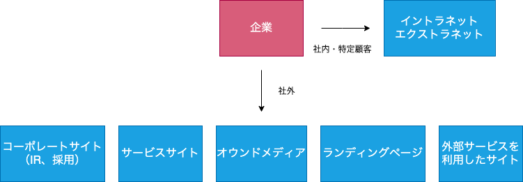

# Webサイトの代表的なパターンと目的

## 起業Webサイトのタイプ別分類

### コーポレートサイト

企業Webサイトの基本であり、会社案内、事業紹介の役割

企業イメージを全面に打ち出す  
必要な情報をわかりやすく提示する  
多くの場合、自社の製品/ソリューションの紹介

### サービスサイト

ネット上でサービスを行うサイト

EC、転職情報、音楽配信、eラーニング、不動産、キュレーションなど  
ネットでの成果がすぐに業績につながる  
ネット上で完結、ゴールに近いところまでユーザーを誘導する  
UI/UXが重要  
同業他社のサービスサイトをベンチマークし、いい意味でベストなUI/UXを提供できるようにする

### オウンドメディア

OwnとMediaを組み合わせた造語  
自社の情報を発信するメディア

掲載コンテンツが自社の資産となる  
SEO、ユーザーの囲い込みによる顧客育成に力を発揮する  
広義にとらえると公開しているWebサイトすべてがオウンドメディア  
狭義では、自社ブログ/自社の得意分野をまとめたニュース/キュレーションサイトなど、コンテンツマーケティングを行う場

自社目線にならず、ユーザーにとって魅力的なコンテンツを常に提供し続けなければならない  
自社のブランドイメージとそぐわないものは採用されにくく、リード（見込み客）獲得や事業の利益に結びつかないと社内的になかなか評価されにくい

### ランディングページ

インターネット広告のリンク先として作成され、ユーザーの入り口になるページ  
広告からの着地点となる

特定商品/サービスのために制作される  
離脱防止のため、購入や登録の完了までページ遷移せず1ページで完了させることが多い  
縦に長い独特なレイアウト

業績に直結するため、コンバージョン獲得の対策をLPO（Landing Page Optimization）と呼ぶ  

LPO

- ユーザーがよりコンバージョンしやすいように最適化するもの
  - ボタン、フォームなどのUI/文言/画像
- ターゲットに合わせた複数のランディングページを作成し、ツールによってCVRを計測/最適な形を選択する

### 外部サービスを利用したWebサイト

### イントラネット・エクストラネット
