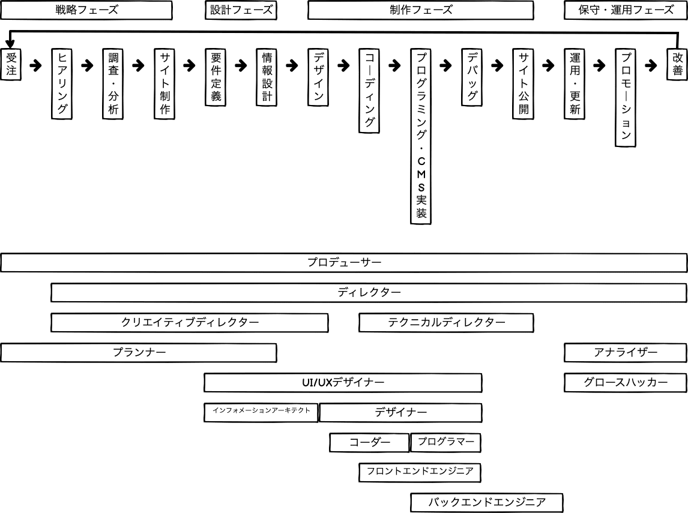

# Webサイト制作に携わるさまざまな職種

## Webサイト制作を広く見渡す職種

### プロデューサー（プロジェクト総括）

- 金銭的マネージメント
- スケジュール管理
- クライアントに対する企画提案

など

### ディレクター（制作現場総括）

- 案件をもとに、現場でどう回していくか
- 制作物の品質管理
- 制作進行の管理
- スタッフへの指示出し

など

## 制作現場におけるさまざまな職種

※上の絵を見る限り、なんだかんだプランナー、コーダー、フロントエンドエンジニア、バックエンドエンジニアはやってきた
