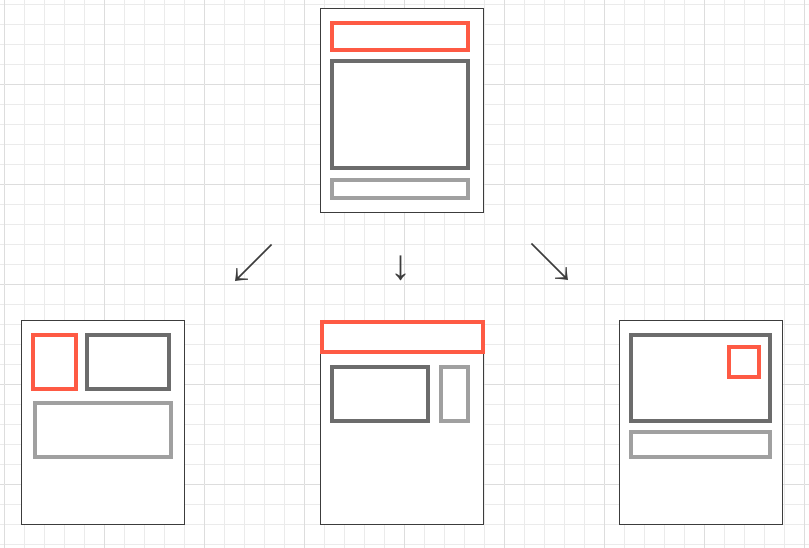
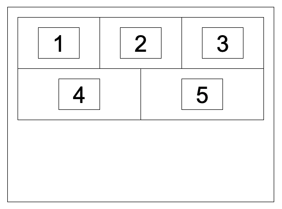
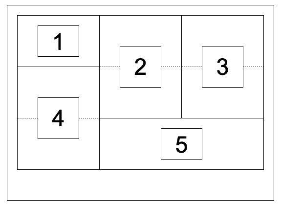

# ブロックをレイアウトするさまざまな方法

## ブロックをレイアウトする方法

デフォルトでは、縦に積まれるレイアウト

やり方によって横並びにしたり、重ねたりできる

CSS3以前は、`float` で左/右から要素を詰めて並べたり、画像の横にテキストを回り込ませたりできる  
しかし、注意する点もいくつかある

同じサイズ感の要素を横並びするとき　→　`display: inline-block;`

次に流行ったのが `flexbox`（Flexible Box LayoutModule）  
1行書くだけで横並びができて、レスポンシブWebデザインとも相性が良い

最近、流行っているのが `CSS Grid`（CSS Grid Layout Module）  
横並びができて、二次元グリッドからグリッドレイアウトが作れる

## 要素を自由な位置に配置する

`position`  

- 要素同士を重ねたり、ずらしたりするときに使う
- メニューボタン、ページトップへのボタンなど、スクロールしても画面に固定させる指定
