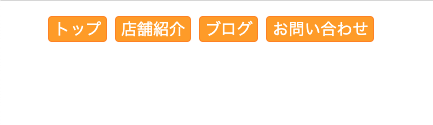
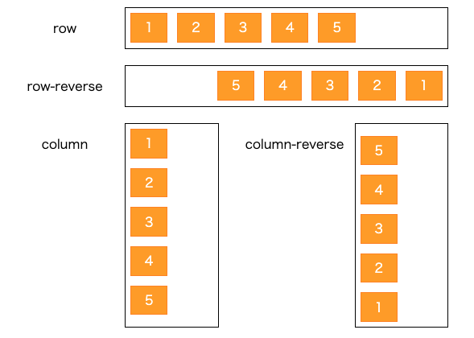
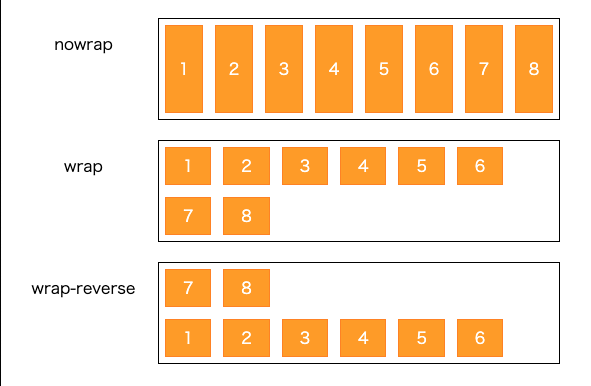
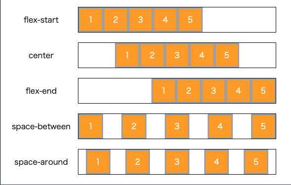
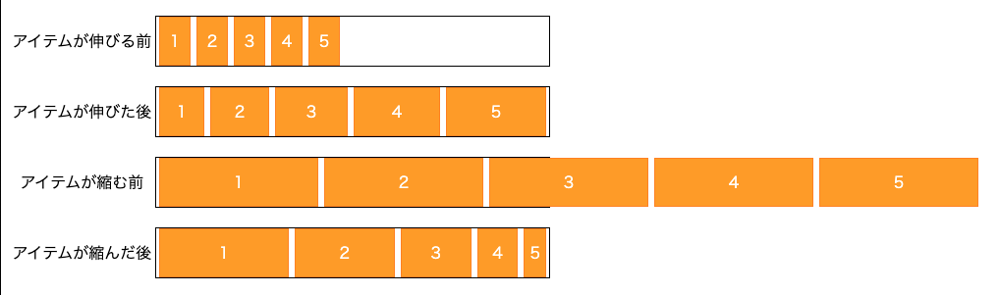

# flexboxを使ったレイアウト

## flexboxの基本

横並びしたい要素の親要素（コンテナー）に `display: flex;` を指定  
コンテナーの直下にある要素（アイテム）が左から横並びになる

`float` みたいなカラム落ち、後続の要素が回り込む心配もない

デフォルト状態

- カラム落ちしない
- 幅はアイテムの内容量によって自動で決まる
- 高さは一番長いアイテムに揃う



[flex-example](https://codepen.io/camomile_cafe/pen/oNzVwGO)

```html
<ul class="container">
  <li class="item1"><a href="#">トップ</a></li>
  <li class="item2"><a href="#">店舗紹介</a></li>
  <li class="item3"><a href="#">ブログ</a></li>
  <li class="item4"><a href="#">お問い合わせ</a></li>
</ul>
```

```css
ul { list-style-type: none; }

.container { display:flex }

.container li {
  background-color: orange;
  border-radius: 4px;
  border: 1px solid darkorange;
  padding: 0 5px;
  margin-right: 8px;
}

li a {
  color: white;
  text-decoration: none;
}
```

## カスタマイズ1: 並べる向きを変える

`flex-direction: [row/row-reverse/column/column-reverse]`

コンテナーに対して、以下の指定をする

- `row`
  - 左から横並び
- `row-reverse`
  - 右から横並び
- `column`
  - 上から縦並び
- `column-reverse`
  - 下から縦並び



[flex-example](https://codepen.io/camomile_cafe/pen/oNzVwGO)

## カスタマイズ2: カラム落ちさせる

`flex-wrap: [nowrap/wrap/wrap-reverse]`

コンテナーに対して、以下の指定をする

- nowrap
  - 1行に収めたいとき
- wrap
  - 記事一覧、ギャラリーのように複数行にわたる場合に使う
- wrap-reverse
  - 複数行で下から積み上がって行く形



[flex-example](https://codepen.io/camomile_cafe/pen/oNzVwGO)

## カスタマイズ3: 配置位置を変える

`justify-content: [flex-start/center/flex-end/space-between/space-around]`

コンテナーに対して、以下の指定をする

- flex-start
  - 左揃え
- center
  - 中央揃え
- flex-end
  - 右揃え
- space-between
  - コンテナーの左端から右端まで均等にアイテムを配置
- space-around
  - コンテナーの左端、右端にも余白を作る



[flex-example](https://codepen.io/camomile_cafe/pen/oNzVwGO)

## カスタマイズ4: アイテムの幅を指定する

`flex: [幅の伸びる比率(flex-grow)] [幅の縮む比率(flex-shrink)] [基本幅(flex-basis)]`

アイテムに対して、以下の指定をする

- `flex-grow`、`flex-shrink`、`flex-basis` の総和がコンテナーの幅になるように指定
- `flex-basis` は`px`、`%`で指定できる
  - `flex-grow`、`flex-shrink` の値によっては、必ずしもその幅になるわけではない
- コンテナー内に存在する余白を各アイテムに割り振る場合は `flex-grow`
- コンテナーからはみ出した余白比率を各アイテムに割り振る場合は `flex-shrink`



[flex-example](https://codepen.io/camomile_cafe/pen/oNzVwGO)
