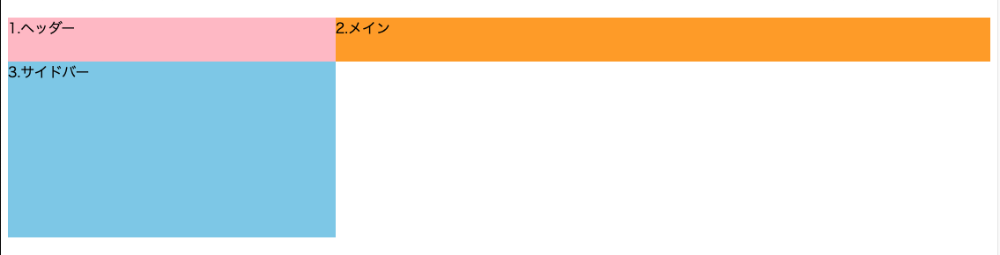
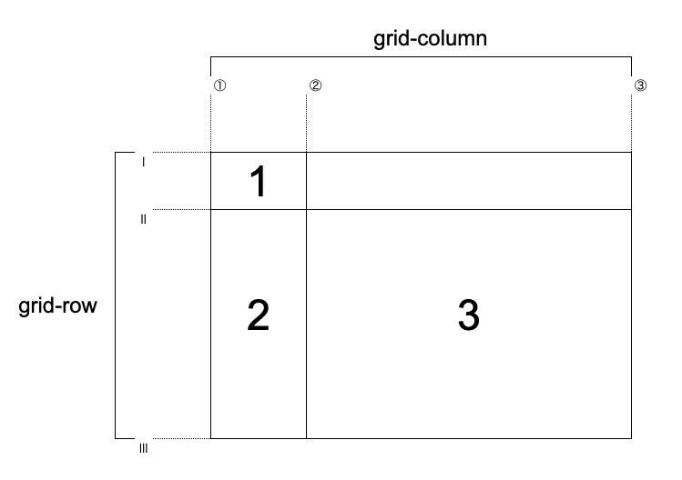
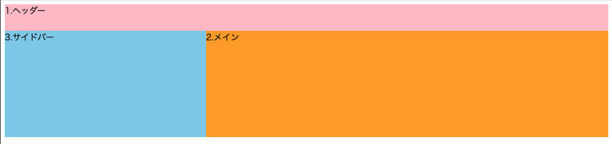

# CSS_Gridで二次元的レイアウト

## CSS Gridとは

`CSS Grid Layout Module`

- グリッドという罫線（けいせん）を生成する
- マス目を使ってレイアウトするシステム

## グリッドの土台を作る

### 基本的な使い方

グリッドレイアウトを配置したい要素の親要素（コンテナー）に `display: grid` を指定  
コンテナーの直下にある要素（アイテム）にグリッドレイアウトを適用できる

### gridの指定

コンテナーに対して、以下の指定をする

- `grid-template-columns: [列の数とそれぞれの列幅]`
  - 列の幅を左から指定する
- `grid-template-rows: [行の数とそれぞれの行高]`
  - 行の高さを上から指定する
- 指定した数だけ列と行が生成される
- 単位は `px` 、 `%` 、 `fr`
  - `fr` は `fraction（分数）` の略
- `fr`を使った指定
  - `1fr 2fr` の場合、要素の幅を `1:2` の比率で割り振れる
  - `1fr 2fr 1fr` の場合、要素の幅を `1:2:1` の比率で割り振れる
  - `100px 1fr` の場合、要素の幅を最初のアイテムは `100px`、2つ目のアイテムは `可変`にできる



```html
<div class="wrapper-grid">
  <div class="item1">1.ヘッダー</div>
  <div class="item2">2.メイン</div>
  <div class="item3">3.サイドバー</div>
</div>
```

```css
.wrapper-grid {
  display: grid;
  grid-template-rows: 50px 200px;
  grid-template-columns: 1fr 2fr;
  margin-bottom: 3vh;
}
.item1 { background-color: pink; }
.item2 { background-color: orange; }
.item3 { background-color: skyblue; }
```

[grid-sample](https://codepen.io/camomile_cafe/pen/KKgEyKN)

## アイテムの配置

アイテムに対して、以下の指定をする

グリッドには見えない罫線があり、各アイテムに「罫線の何番から何番まで」という位置を指定する



- `grid-row: [開始軸/終了軸]`
  - `grid-row: 1/2` だと `Ⅰ` から `Ⅱ` までの行範囲を指す
- `grid-column: [開始軸/終了軸]`
  - `grid-column: 1/3` だと `①` から `③` までの列範囲を指す



```html
<div class="wrapper-grid">
  <div class="col1 item1">1.ヘッダー</div>
  <div class="col2 item2">2.メイン</div>
  <div class="col3 item3">3.サイドバー</div>
</div>
```

```css
.wrapper-grid {
  display: grid;
  grid-template-columns: 1fr 2fr;
  grid-template-rows: 50px 200px;
}

.item1 {
  grid-row: 1/2;
  grid-column: 1/3;
}

.item2 {
  grid-row: 2/3;
  grid-column: 2/3;
}

.item3 {
  grid-row: 2/3;
  grid-column: 1/2;
}

.col1 { background-color: pink; }
.col2 { background-color: orange; }
.col3 { background-color: skyblue; }
```

[grid-sample](https://codepen.io/camomile_cafe/pen/KKgEyKN)
