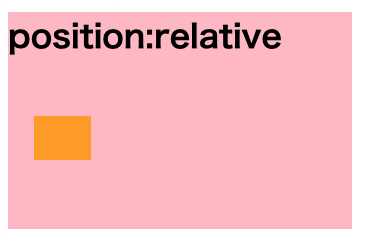
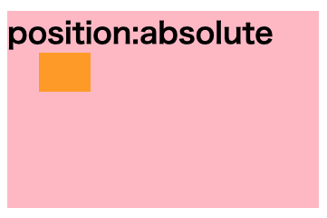
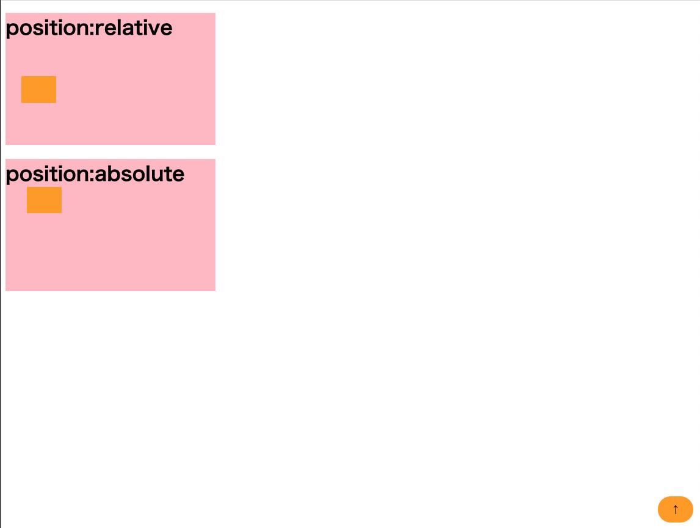

# positionを使った要素の自由配置

## 要素の位置を変える

`position: relative`

もとの要素位置を基準にする  

どれだけずらすかを `top/bottom/left/right` で指定する



```html
<div class="background">
  <h1>position:relative</h1>
  <div class="relative"></div>
</div>
```

```css
.background {
  background-color: pink;
  margin-bottom: 2vw;
  width: 30vw;
  height: 25vh;
}

.relative {
  position: relative;
  background-color: orange;
  width: 5vw;
  height: 5vh;
  top: 3vw;
  left: 3vh;
}
```

[position-sample](https://codepen.io/camomile_cafe/pen/MWjRyoY)

## 親要素を基準に位置を決める

`position: absolute`

動かしたい要素に指定する  
親要素には `position: relative` を指定することで、親要素を位置の基準にする

`top/bottom/left/right` の指定は `relative` になっている要素を位置基準とする



```html
<div class="background-relative">
  <h1>position:absolute</h1>
  <div class="absolute"></div>
</div>
```

```css
.background-relative{
  background-color: pink;
  margin-bottom: 2vw;
  width: 30vw;
  height: 25vh;
  position:relative;
}

.absolute {
  position: absolute;
  background-color: orange;
  width: 5vw;
  height: 5vh;
  top: 4vw;
  left: 4vh;
}
```

[position-sample](https://codepen.io/camomile_cafe/pen/MWjRyoY)

## ウィンドウに固定する

`position: fixed`

Webブラウザのウィンドウを基準にして、スクロールしても動かず固定できる



```html
<div class="fixed">
  <span>
    ↑
  </span>
</div>
```

```css
.fixed {
  position: fixed;
  width: 5vw;
  height: 5vh;
  background-color: orange;
  bottom: 1vh;
  right: 1vw;
  border-radius: 3vw;
  display: grid;
  justify-items: center;
  align-items: center;
}
```

[position-sample](https://codepen.io/camomile_cafe/pen/MWjRyoY)
