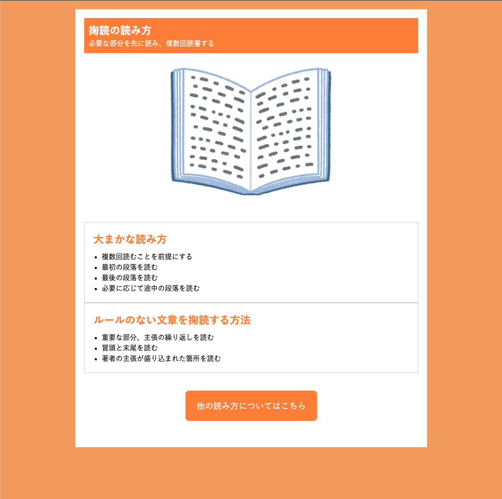
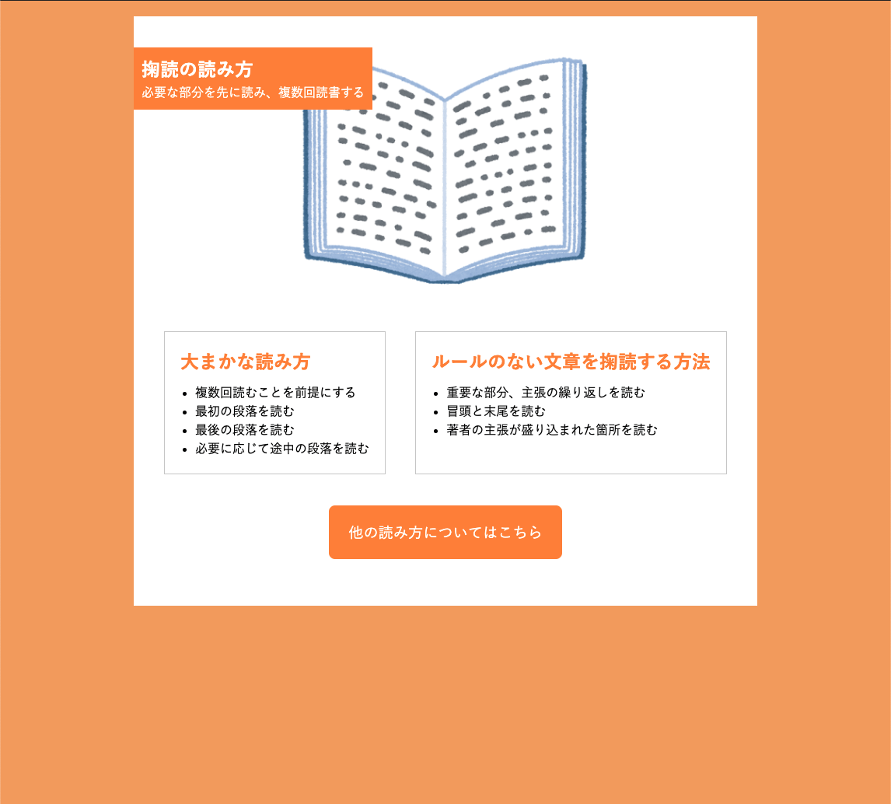

# チャレンジしてみよう！ 要素を動かすCSSを使ってみよう

## 現在のスタイルを確認する



[html-add-deco](./html/html-add-deco.html)

## ヘッダーの位置を動かす

`acticle` を基準に `header` を動かす

```css
article {
  ︙
  position: relative;
}

header {
  ︙
  position: absolute;
  top: 40px;
  left: 0;
}

```

## <section>を横並びにする

2つの `section` を囲む `div`を追加し、`display: flex;` 指定をする  
`section` を横並びして、左右の端に余白を作る

```html
︙
<div class="flexContainer">
  <section>
    ︙
  </section>
  <section>
    ︙
  </section>
</div>
︙
```

```css
.flexContainer {
  display: flex;
  justify-content: space-around;
}
```



[html-add-deco-refresh](./html/html-add-deco-refresh.html)
