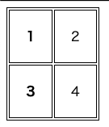
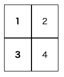
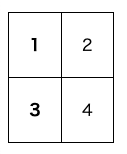
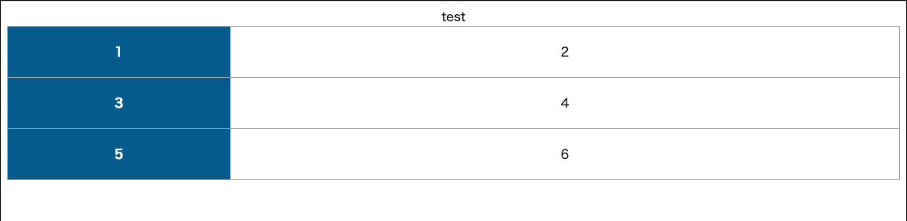
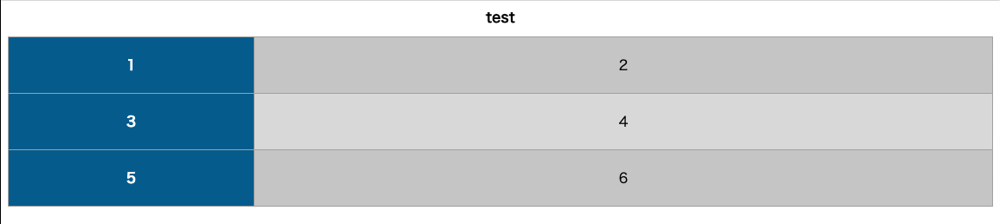

# テーブルをデザインする

## 境界線の設定をする

`table` タグに `border: 1px solid` を記述するだけでテーブルの枠の表示はできる  
ただ、CSSでスタイリングするときは、`th` 、 `td` に対して `boarder` で指定する



```html
<table class="table-border">
  <tr>
    <th>1</th>
    <td>2</td>
  </tr>
  <tr>
    <th>3</th>
    <td>4</td>
  </tr>
</table>
```

```css
th,td {
  border: 1px solid;
  padding: 20px;
}

.table-border {
  border: 1px solid;
}
```

`table` 側の枠線なしに `th` , `td` の `border` を使って、枠線同士をくっつけて表示する方法もある  
`border-spacing` は、隣接するセルのボーダー同士の間隔を指定する際に使用する  
以下の例は、ボーダー同士の間隔を0にしてくっつけている



```html
<table class="table-border">
  <tr>
    <th>1</th>
    <td>2</td>
  </tr>
  <tr>
    <th>3</th>
    <td>4</td>
  </tr>
</table>
```

```css
th,td {
  border: 1px solid;
  padding: 20px;
}

.table-border {
  border-spacing: 0;
}
```

さらに、隣接しているボーダー同士を重ねて表示することで、二重で表示されていた線を1つに表示することもできる



```html
<table class="table-border">
  <tr>
    <th>1</th>
    <td>2</td>
  </tr>
  <tr>
    <th>3</th>
    <td>4</td>
  </tr>
</table>
```

```css
th,td {
  border: 1px solid;
  padding: 20px;
}

.table-border {
  border-spacing: 0;
  border-collapse: collapse;
}
```

各行だけに境界線をつけたい場合は、 `tr` で指定できる

## 各列の幅を決めるアルゴリズム

`table-layout` は、 `table` タグに対して指定する  

- `table-layout: auto`
  - 各列の文字量によって自動的に列幅が配分される
  - 
- `table-layout: fixed`
  - 1行目を読み込んだ段落で幅が決まる
  - 必要に応じて `width` で各列の幅を指定できる



```html
<table>
  <caption>test</caption>
  <tr>
    <th>1</th>
    <td>2</td>
  </tr>
  <tr>
    <th>3</th>
    <td>4</td>
  </tr>
  <tr>
    <th>5</th>
    <td>6</td>
  </tr>
</table>
```

```css
table {
  border-spacing: 0;
  border-collapse: collapse;
  table-layout: fixed;
  width: 100%;
  margin-bottom: 20px;
}

/* セルの共通部分を指定 */
th,td {
  border: 1px solid #aaa;
  padding: 20px;
}

/* thの個別指定 */
th {
  width: 25%;
  background: #069;
  color: #fff;
  font-weight: bold;
  text-align: center;
}

/* tdの個別指定 */
td {
  text-align: center;
}
```

[table-sample2](https://codepen.io/camomile_cafe/pen/QWKRxYR)

## 背景の色を交互に変える

奇数、偶数でそれぞれに背景色を指定する

- 奇数
  - `:nth-of-type(odd)`
- 偶数
  - `:nth-of-type(even)`
- 任意の数字の場合
  - `:nth-of-type(数字)`



```html
<table>
  <caption>test</caption>
  <tr>
    <th>1</th>
    <td>2</td>
  </tr>
  <tr>
    <th>3</th>
    <td>4</td>
  </tr>
  <tr>
    <th>5</th>
    <td>6</td>
  </tr>
</table>
```

```css
* { box-sizing: border-box; }

caption {
  font-weight: bold;
  margin-bottom: 10px;
}

table {
  border-spacing: 0;
  border-collapse: collapse;
  table-layout: fixed;
  width: 100%;
}

tr:nth-of-type(odd) { background: #ccc; }
tr:nth-of-type(even) { background: #ddd; }

th,td {
  border: 1px solid #aaa;
  padding: 20px;
}

th {
  width: 25%;
  background: #069;
  color: #fff;
  font-weight: bold;
  text-align: center;
}

td {
  text-align: center;
}
```

[table-sample3](https://codepen.io/camomile_cafe/pen/rNMgraM)
