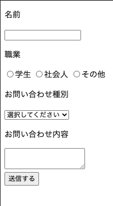

# フォームをデザインする

## デフォルトスタイルの違いを知る

ブラウザによってデフォルトスタイルが違う  
なので、サイトのテイストに合わせて見た目を変えるとき、リセットしてからデザインしていく方法がある  
ただ、リセットの記述が非常に長いうえ、アクセスビリティに良くない記述も含まれえている

慣れるまではデフォルトスタイルを生かしてうわあがきしていくと良い

フォームはユーザーが操作するものなので、使いやすさを第一に考えてデザインする

### フォームの基本型



```html
<form>
  <p>名前</p>
  <input type="text" name="userName"> 
  <p>職業</p>
  <label class="job"><input type="radio" name="job" value="student"/>学生</label>
  <label class="job"><input type="radio" name="job" value="working"/>社会人</label>
  <label class="job"><input type="radio" name="job" value="etc"/>その他</label>
  <p>お問い合わせ種別</p>
  <select name="messageType">
    <option value="default">選択してください</option>
    <option value="select1">選択肢1</option>
    <option value="select2">選択肢2</option>
  </select>
  <p>お問い合わせ内容</p>
  <textarea name="message"></textarea>
  <div class="btn"><input type="submit" value="送信する" /></div>
</form>
```

## デザイン例1

`input` タグは `type` 属性を変えることでさまざまなフォーム部品に変えられる

type種類

- button
- checkbox
- color
- date
- datetime-local
- email
- file
- hidden
- image
- month
- number
- password
- radio
- range
- search
- submit
- tel
- text
- time
- url
- week

[<input>: The Input (Form Input) element - HTML: HyperText Markup Language | MDN](https://developer.mozilla.org/en-US/docs/Web/HTML/Element/input)

ただ、 `input` タグへのスたいつ指定をすると、違う種類のフォーム部品にも同時に適用される可能性がある  
そこで、 `属性セレクタ`を部品ごとに指定する

`input[type="type種類"] {･･････}`


## デザイン例2

`p` 、 `div` タグ以外にも `dl`タグ（definition list、定義リスト）を使う方法もある

- `dt` タグ（definition term、定義する言葉）
  - 項目名
- `dd` タグ（definition description、定義の説明）
  - 入力欄

`dl` タグを使うと、PC画面では2カラムでスマホ画面では1カラムという切り替えもできる


```html
<form>
  <dl class="formItem">
    <dt>名前</dt>
    <dd><input type="text" name="userName"></dd>
  </dl>
  <dl class="formItem">
    <dt>職業</dt>
    <dd>
      <label class="job"><input type="radio" name="job" value="student"/>学生</label>
      <label class="job"><input type="radio" name="job" value="working"/>社会人</label>
      <label class="job"><input type="radio" name="job" value="etc"/>その他</label>
    </dd>
  </dl>
  <dl class="formItem">
    <dt>お問い合わせ種別</dt>
    <dd>
      <select name="messageType">
        <option value="default">選択してください</option>
        <option value="select1">選択肢1</option>
        <option value="select2">選択肢2</option>
      </select>
    </dd>
  </dl>
  <dl class="formItem">
    <dt>お問い合わせ内容</dt>
    <dd>
      <textarea name="message"></textarea>
    </dd>
  </dl>
  <div class="btn"><input type="submit" value="送信する"></div>
</form>
```

```css
@charset "UTF-8";

/* 共通指定 */
*{
  box-sizing: border-box;
  font-size: 14px;
  color: #333;
}

body {
  background: #ddd;
}

/* formエリアの指定 */
form {
  margin: 10px;
  padding: 20px;
  background: #fff;
}

dl {
  margin: 0;
  font-size: 16px;
}

/*
フォームごとの共通指定
flexboxを使うことで、コンテナー化して、dt、ddが横並びになる
*/
.formItem {
  display: flex;
  margin-bottom: 2em;
  align-items: center;
}

/* 項目名 */
dt {
  flex: 1 1 30px;
  text-align: right;
  margin-right: 1em;
  font-weight: bold;
  color: #00a;
}

/* 各項目の入力欄 */
dd {
  flex: 2 1 30px;
  margin-left: 0;
}

/* フォームパーツの指定 */
input[type="text"], textarea {
  border: 1px solid #999;
  width: 100%;
  padding: 10px;
  border-radius: 5px;
}

.job {
  margin-right:.8em;
}

select {
  background: #fff;
  width: 100%;
  height: 32px;
  font-size: 14px;
  border-radius: 5px;
}

textarea {
  height: 5em;
}

/* 送信ボタンの指定 */
.btn {
  text-align: center;
}

input[type="submit"] {
  background: #00a;
  border: none;
  width: 100%;
  padding: 10px;
  border-radius: 5px;
  color: #fff;
  font-size: 14px;
}

/*
ウィンドウ幅768pxだと、一般的なタブレットやスマホに適用させるサイズ

displayをflexboxからblockにすることで、子要素の横並びを解除
*/
@media screen and (max-width: 768px) {
  .formItem {
    display: block;
  }
  
  dt {
    text-align: left;
    margin-bottom: 4px;
  }
  
  dd {
    margin-left: 0;
  }
  
  .job {
    margin-right:.8em;
  }
}
```

[input-form2](https://codepen.io/camomile_cafe/pen/ExgzJZd)
