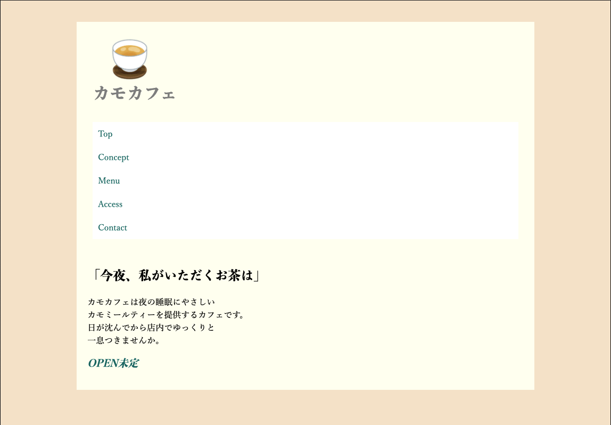
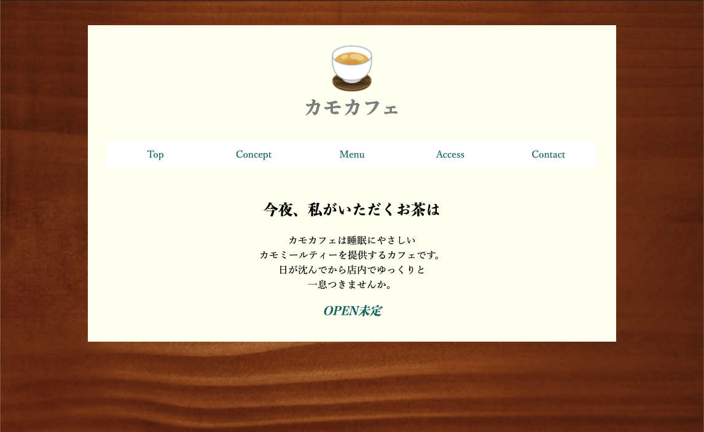
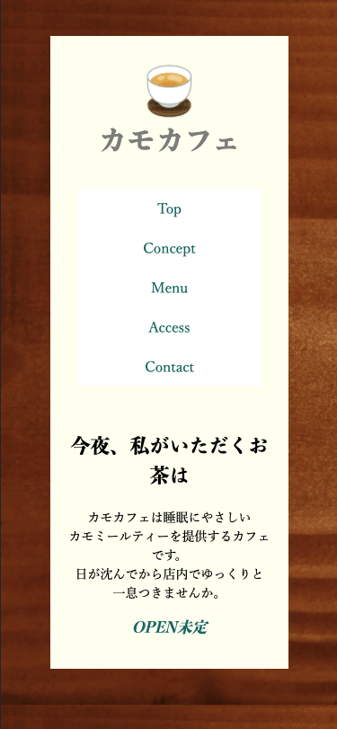

# チャレンジしてみよう！ 背景画像やグローバルナビゲーションを表現しよう

## 現在のスタイルを確認する



[html-caffee](./html/html-caffee.html)

[basic_coffee](./css/basic_coffee.css)

## ページ全体に背景画像を表示する

`body` に背景画像と背景色を指定する

```css
body {
  background: url(../img/wood-texture.jpg) #8c5d4f repeat; /* 背景画像に近い色を指定する */
}
```

全体の要素を中央揃えにする

```css
body {
  text-align: center;
}
```

## グローバルナビゲーションを作成する

- リストのマーカーを削除する
  - `list-style: none;`
  - デフォルトでマーカー分の左 `padding` があるので、 `0` にする
    - `padding-left: 0;`
- `li` タグを横並びにする
  - `flex` 指定
- アイテムをすべて同じ幅にして隙間なく配置する
  - 5等分のアイテムなので、`20%` ずつにして、伸び/縮み比率は `1` に指定

```css
ul {
  list-style: none;
  padding-left: 0;
  display:flex;
}

li {
  flex:1 1 20%;
}
```

## できあがった画面




