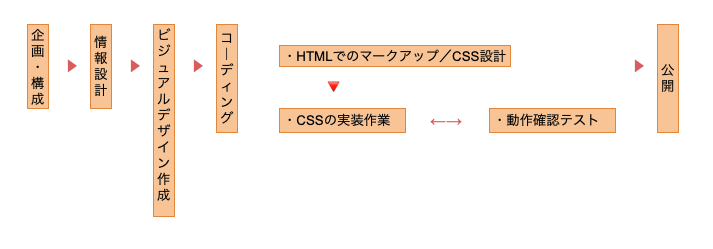

# 制作現場での進め方を見てみよう

## 実務でのワークフロー

以下のようなワークフローが一般的

## なるべく「手戻り」を発生させない

規模の大きさに関わらず、**前の工程への手戻りをなるべく発生させない**ことは重要

形が決まっていないのにコーディングをすすめると、クライアントが納得せずデザインからやり直しをするケースもある

## 前後の工程の進めやすさも考える

主に、Webデザイナーが担当する領域  
**ビジュアルデザイン**と**コーディング**

グラフィックソフトで作成したビジュアルデザインをもとに、コーディングをすすめる

担当工程がどこなのかに関わらず、全体の工程を理解するのは重要  
前後の工程で受け持つ人がどうしたらっ効率出来に作業を進められるかもも考える
